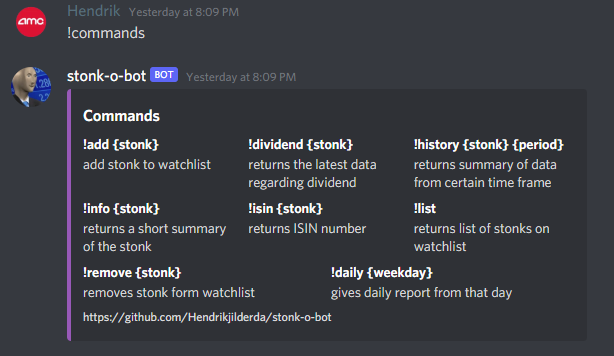
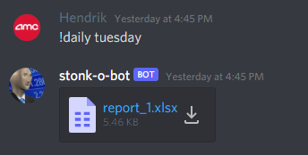
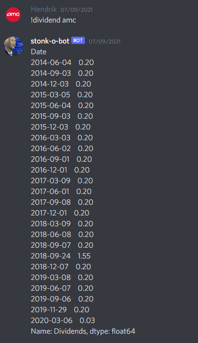
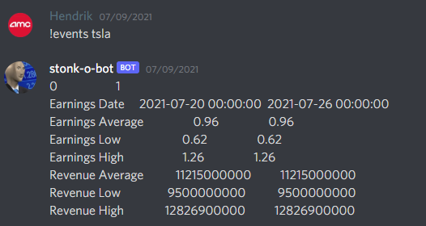
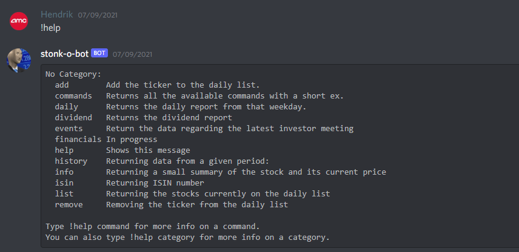
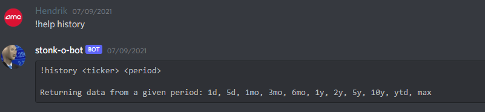
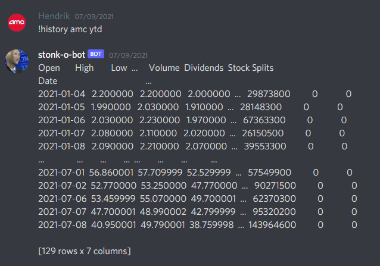
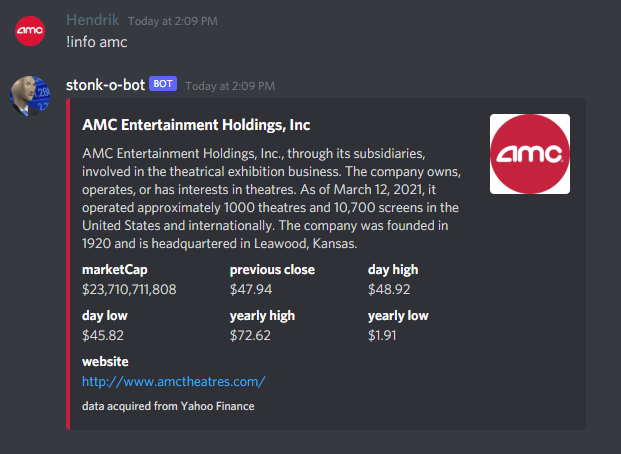

# stonk-o-bot - Discord Bot
This discord bot uses [yfinance](https://pypi.org/project/yfinance/) for importing useful data from Yahoo finance.
A [docker image](https://hub.docker.com/repository/docker/hendrikjilderda/stonk-o-bot) of Stonk-o-bot can be found here 


This is one of my python projects. If you have any useful tips feel free to leave them behind!

## Table of Contents
* [General Info](#GeneralInfo)
* [setup](#Setup)
* [Usage](#Usage)
* [Screenshots](#Screenshots)
* [Project Status](#ProjectStatus)


## General Info 
This Discord bot uses yfinance to import stock data into discord. 
Inside a discord channel you can use commands to retrieve certain data from a stock. 
All commands are explained in the [Commands](#Commands) section.

## Setup
This bot uses the following libraries. These libraries can be installed using pip.

Alternatively the requirements.txt can be used. However, not all the packages from this file are used.
* ### os
  Is used for the environment variable in the docker image.
* ### sys
  Is used for the error handling
* ### discord
  Is used for implementing the commands
* ### discord.ext
  Is used together with discord for implementing the commands
* ### yfinance
  Is used for retreiving the data from Yahoo Finance
* ### datetime 
  Is used for basic time 
* ### colorthief
  Is used for coloring the embed 


## Usage
* ### !add
```
!add <ticker>
```
Adds a ticker to the daily watch list. This list is used for automatical reports.

* ### !commands
```
!add <token>
```
Returns a list with all the commands with a short description.
* ### !daily 
```
!daily <weekday>
```
Returns a report from that specific weekday. Reports get saved for one week.

* ### !dividend
```
!dividend <ticker>
```
Returns short list with the recent dividend data.

* ### !events 
```
!events <ticker>
```
Returns information about the latest investors meeting.

* ### !financials [work in progress]
```
!financials <ticker>
```
work in progress.

* ### !history
```
!history <ticker> <period>
```
Returns data from a certain period of the stock.
* ### !info
```
!info <ticker>
```
Returns a short summary of the stock.

* ### !isin
```
!isin <ticker>
```
Returns the ISIN number.

* ### !list
```
!list
```
Returns the daily watch list list.

* ### !remove
```
!remove <ticker>
```
Removes a ticker from the daily watch list. This list is used for automatical reports.

## Screenshots










## Project Status
Project is still in progress


